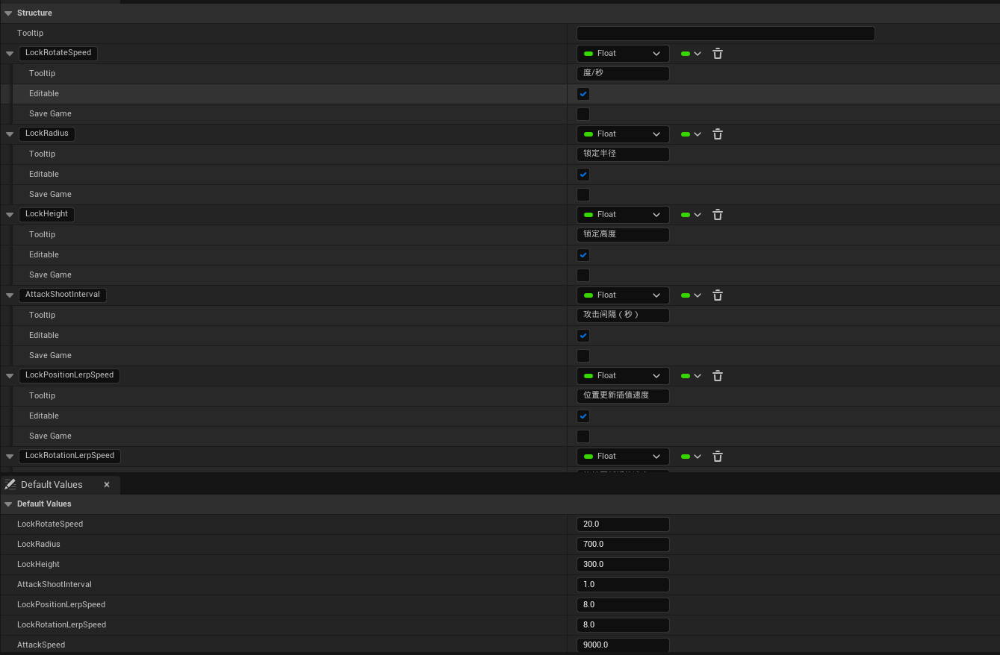
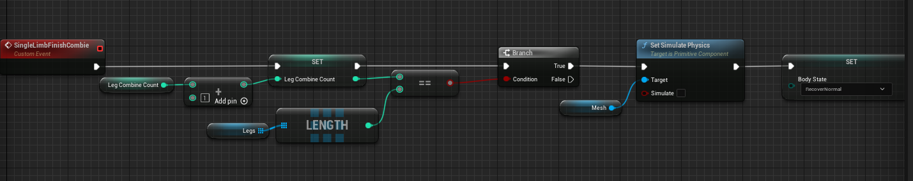

# 程序化动画
## Demo简介
该Demo是一个基于UE5 Control Rig制作的怪物程序化动画案例，其中所有动画都是运行时计算的，没有离线动画资产。案例中展示了怪物基础移动，肢体分解，独立移动到拼接的过程，另外怪物还有一个攻击动作

## 项目结构

- Body:怪物躯干资源
- Legs:怪物肢体
- GameData:配置档
- AC_Leg:肢体主逻辑
- BP_ProceduralMonster:怪物主逻辑

肢体的ControlRig配置

## 配置参数
配置参数位于GameData目录下，通过结构体配置，分别控制怪物主体及肢体不同移动模式下的参数

攻击配置:

绑定移动配置：

自由移动配置：

## 技术细节

### 怪物主体结构的实现
怪物主要由两个部分组成，身体及肢体，因为肢体跟随身体移动的同时又要独立移动，所以为了方便处理逻辑，肢体会作为身体的一个子Actor存在

为了方便绑定，在身体的骨架上配置了多个Socket，方便挂载肢体

### 肢体主体结构的实现

这里ControlRig通过组件的方式接入，所以整个肢体部分的动画并没有使用动画蓝图

肢体的ControlRig配置主要是通过CCDIK来实现，通过限制根骨骼旋转保证肢体在结算方向的正确，在控制根骨骼旋转的控制点上默认加上了90度的偏移

### 绑定移动处理

绑定移动的主要处理逻辑是让肢体根骨骼跟随身体移动（因为是绑定到身体上的，这里默认就有这个特性），肢体末端骨骼锁定到落脚点的位置，当检测点与锁定点偏移超过设定值时，更新锁定点到检测点位置，检测方法如图所示：

肢体检测落脚点逻辑

锁定点更新的处理

另外需要注意的是为了让怪物移动看起来更加自然，怪物的肢体移动需要保证是不同频率的，这里的处理就是在怪物跨出第一步的时候，只跨出目标偏移的一半，这样腿与腿之间就会有一种交叉移动的效果

### 物理移动处理

物理移动的处理分为两个部分，一个是身体的物理，一个是肢体的物理
身体的物理比较简单，在需要激活物理时开启身体的物理模拟就行了

肢体的物理模拟需要先禁用ControlRig,否则两者会互相影响，在开启物理后给肢体施加一个冲量

### 自由移动处理

自由移动分为两步，分别是锁定末端骨骼移动根骨骼和锁定根骨骼移动末端骨骼，当一端移动完毕后就切换到另一端移动

### 吸附移动的处理

吸附移动主要是在自由移动结束时拼接到身体的移动，主要分为两部分，一是将根骨骼移动到目标Socket位置，这期间需要锁定末端骨骼，当根骨骼移动完毕后，根据Socket位置及朝向进行一次射线检测，确定末端骨骼的位置，并移动末端骨骼到目标位置

最后在所有肢体拼接完毕后关闭身体的物理模拟，将身体抬高到初始位置

### 攻击处理

攻击分为锁定和攻击，锁定时怪物肢体会锁定玩家并绕玩家旋转，玩家移动时也会同步更新位置，锁定完成后，肢体将会随机射向玩家
锁定玩家的实现主要是以玩家为中心，均匀取圆上的点

根据配置的旋转速度，在之上增加位移

攻击玩家时会间隔一定时间，随机肢体进行攻击

攻击过程中会进行射线检测来检测命中点，当命中物体后就停止移动

### 怪物移动处理

这是只是一个简单的处理，让怪物位置和旋转跟随玩家

## 遗留问题
1. 肢体拼接时与身体穿模的问题，需要对肢体移动控制更准确一些
2. 肢体移动还是有些僵硬，目前只有XY平面的移动，后续可以加入Z方向的偏移，并且引入曲线来解决这个问题

## 总结
1. 动画的产生主要通过ControlRig中的CCDIK实现，理论上只要有CCDIK就能实现，不用ControlRig也行
2. 程序化动画的支持需要程序来精准控制，以及串联流程，动画部分依赖配置，如果要批量投入制作需要开发出一套制作流程出来，主要是配置流程，程序可以开发出一些基础库出来，策划配置调用就行了，否则程序制作工作量也挺大